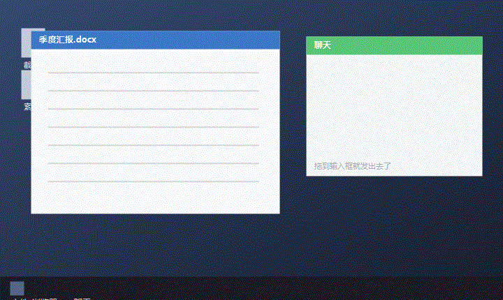
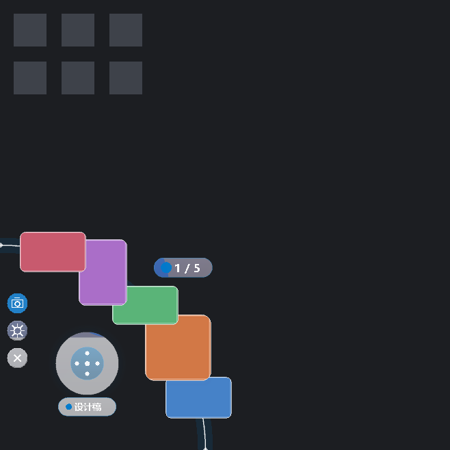
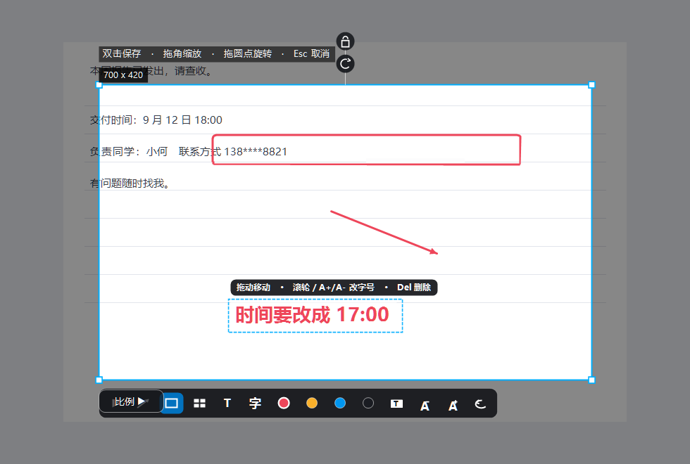
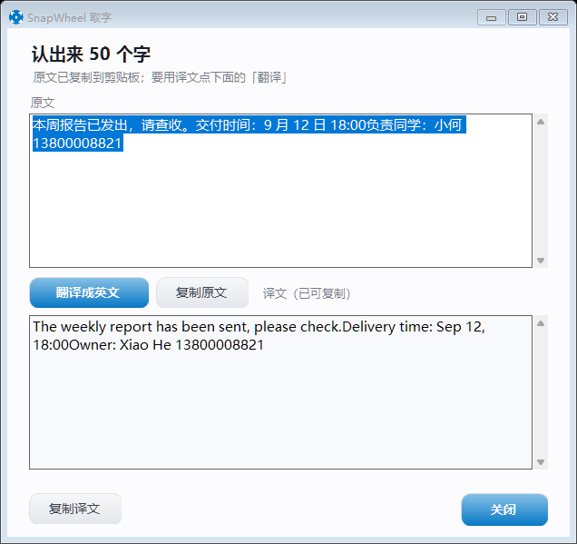
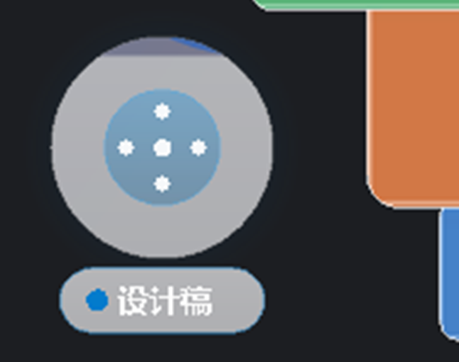
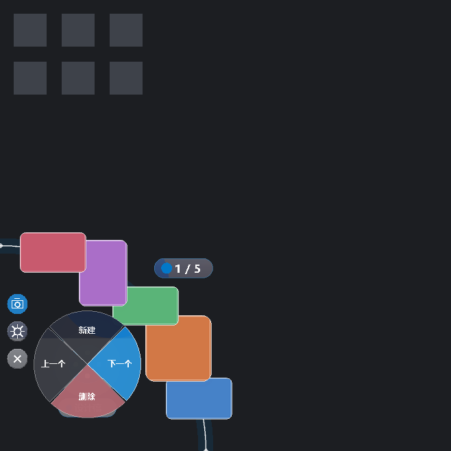
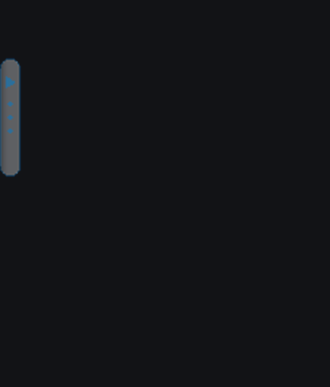
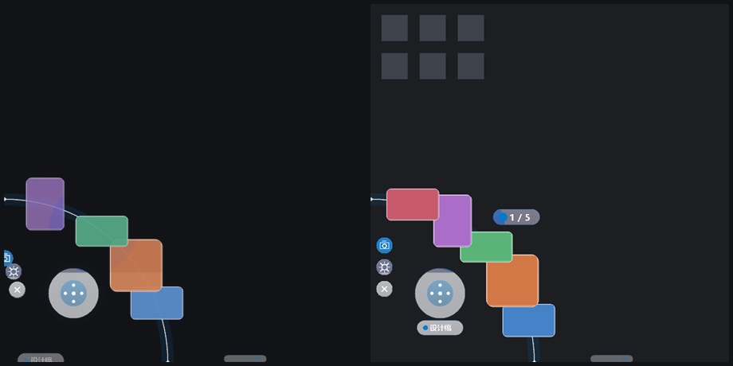
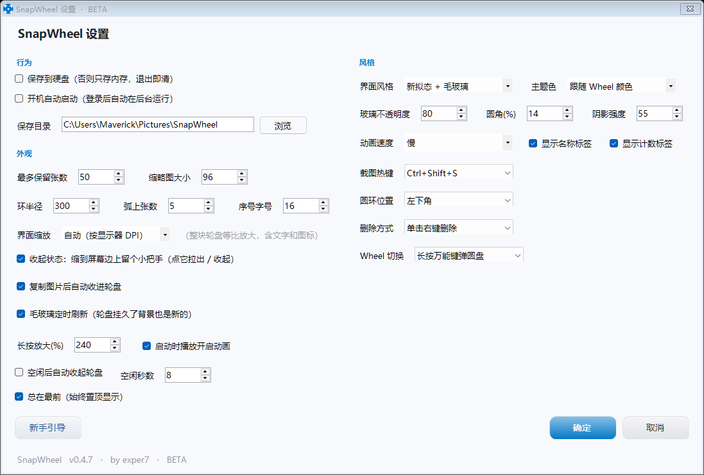

# “Maybe the best screenshot tool out there” — SnapWheel：快照轮环

**English** ・ [中文说明](#中文说明)

**Screenshots that never become files. Capture, and the shot slides into a ring in the corner of your screen — drag it straight into any app when you need it.**



| | |
|---|---|
| 🎯 **Capture into the corner** | `Ctrl+Shift+S`, drag a region — no save dialog, no window switching, no file hunting |
| ↔️ **Drag out to send** | Drop a thumbnail into WeChat / Word / Explorer / any app, release, done. Copy semantics: the ring keeps a copy |
| 📜 **Scrolling capture** | Frame an area and it scrolls + stitches a long image by itself, stopping when the page ends *(new in 0.6.0)* |
| 🔍 **OCR + translation** | Copy text out of any screenshot, translate it in one click. Works on dark, low-contrast text *(new in 0.6.0)* |
| ↩️ **Undoable** | Undo the last delete (the last 8 are kept). Nothing is written outside `%APPDATA%` |

A single exe · portable · no installer · no registry writes (autostart optional) · no model files bundled · **zero third-party dependencies**.

---

## What it is

SnapWheel is a ring of thumbnails that lives in a screen corner. Screenshots you take slide into it immediately — they stay in memory, not as files. Drag one out into any application (a chat window, a document, a folder) and it is delivered as a real image or file. Drag an image *back* onto the ring to keep it.

Multiple "wheels" are supported: long-press the universal key in the middle of the ring and drag towards one of four directions to create / switch / delete / go back.

## Quick start

1. Download `SnapWheel-v0.6.0-full.zip` from [Releases](../../releases), unpack anywhere.
2. Run `SnapWheel.exe`. It sits in the corner with a small pull-tab.
3. Press `Ctrl+Shift+S`, drag a region, release. The shot lands in the ring.
4. Drag the thumbnail into any app to use it.

**Two build lines ship from the same source:**

| Build | What it is |
|---|---|
| `SnapWheel.exe` (full) | Includes the "universal key" dial inside the ring |
| `SnapWheel-nokey.exe` | Same app without the universal key — for people who find the dial distracting |

## How to use

| Action | How |
|---|---|
| Capture | `Ctrl+Shift+S`, drag; resize from the corners, rotate with the dial, confirm with double-click / `Enter` |
| **Carry** (keyboard) | `Ctrl+Alt+C` — lift the current thumbnail with a fake cursor, steer it with the **arrow keys** (`Shift` = faster), `Space` to drop it into whatever window you switched to, `[` `]` to switch image, `C` = copy only, `Esc` to cancel (the thumbnail flies back to the ring). **Prefer the arrow keys**: `WASD` also works but types those letters into the target window |
| Annotate | The overlay toolbar has arrow / box / mosaic / text, four colours, `Ctrl+Z` to undo. Annotations are baked into the image |
| OCR | The 字 button on the overlay toolbar copies the text inside your selection; the tray menu can also OCR the clipboard image |
| Zoom preview | Hold still on a thumbnail for ~0.3 s |
| Send it | Drag a thumbnail out to WeChat / a folder / anywhere |
| Keep an image | Drag it from anywhere onto the ring |
| Pin to screen | Click the **nail** at the right end of the capture toolbar — the shot is pinned where you framed it **and** goes into the ring. Or middle-click a thumbnail; scroll to zoom, drag to move, double-click / `Esc` to close |
| Browse | Scroll the wheel over the ring |
| Rename | Click the name pill |
| Import | Tray menu → Import images… |
| Scrolling capture | Open the capture overlay, frame the area, click the long-image button on the toolbar. It scrolls and stitches; `Enter` finishes early, `Esc` cancels |

## Requirements

| | |
|---|---|
| OS | Windows 10 / 11 (OCR needs Windows 10+) |
| Runtime | .NET Framework 4.x — already part of Windows, nothing to install |
| OCR language pack | Simplified Chinese / English usually ship by default; otherwise enable the "Optical character recognition" optional feature for that language |
| Size | One exe, no installer, no third-party dependencies. Settings and logs live in `%APPDATA%\SnapWheel` |

## Build from source

The whole thing is plain C# compiled with the .NET Framework compiler that ships with Windows:

```powershell
$csc = "C:\Windows\Microsoft.NET\Framework64\v4.0.30319\csc.exe"

# full build (with the universal key)
& $csc /nologo /optimize+ /target:winexe /win32icon:snapwheel.ico /out:SnapWheel.exe src\*.cs

# no-key build (the only difference is /define:NO_KEY)
& $csc /nologo /optimize+ /define:NO_KEY /target:winexe /win32icon:snapwheel.ico `
  /out:SnapWheel-nokey.exe src\*.cs
```

`tools\build.ps1` wraps the whole thing (compile both lines, run tests, produce the release zips).

## How it is built

- **Everything is drawn by code.** The ring is an `UpdateLayeredWindow` window painted with GDI+; buttons, rounded corners, neumorphic shading and the toolbar icons are all vector paths. There is not a single image asset in the app.
- **The frosted glass is hand-made** (screen grab → box blur → clipped to the panel shape), because a layered window cannot use the system acrylic — and acrylic would wash a grey rectangle over the whole screen corner.
- Layered rendering with a 64-bit signature decides which cached layer to reuse, so a frame normally costs a few milliseconds.
- Sources are split by responsibility in `src\` (numbered files = reading order); `tests\` holds the offline renderers and the behaviour tests.

## License

MIT — see [LICENSE](LICENSE).

---

## 中文说明

> **截完图还要先保存、再切窗口、再去文件夹里翻出来 —— 其实你只是想把这张图粘进微信。**

**SnapWheel 把截图变成了顺手的一件事**：`Ctrl+Shift+S` 框选，图**不弹保存框、直接滑进屏幕角落的环里**；要用的时候把缩略图**拖进聊天框 / 文件夹**就完事。反过来，从桌面或浏览器把图拖回环上就收着了。

绿色免安装 · 单文件 C# / WinForms · **零第三方依赖** · 一个 365 KB 的 exe，Windows 10 / 11 双击就跑。


  
  <br><sub>框选 → 图自动滑进角落的环里 → 拖出去直接用（图还留在环上）</sub>

  <a href="https://github.com/ExpertKT/SnapWheel/releases/latest"><b>⬇️ 下载最新版</b></a>
  &nbsp;·&nbsp; <a href="https://github.com/ExpertKT/SnapWheel/releases/latest">完整版</a>（含万能键，推荐）
  &nbsp;·&nbsp; <a href="https://github.com/ExpertKT/SnapWheel/releases/latest">无万能键版</a>（0.2 线，已定稿）
  <br><sub>解压双击 <code>SnapWheel.exe</code> 即用，不需要安装；两个 zip 在同一个 Release 里</sub>

  

---

## 它是什么

屏幕角落常驻的一段**四分之一圆环**。截图不弹保存框、不落地成文件，直接变成环上的缩略图；要用的时候从环上拖到微信、文件夹、任何地方；反过来，从桌面或浏览器把图片拖到环带上就能收进来。

**纯 C# / WinForms 实现（src\ 下按类型分文件），绿色免安装，零第三方依赖** —— 一个 365 KB 的 exe，拷到任何 Windows 10/11 上双击就能跑。

## 这次更新（v1.0.0 正式版）

**1.0 的意思是：从这一版起，上面那些承诺我敢替你担保了。** 这一轮补的是一条**新功能**、一批"手感"、和三个用户报上来但根因都不在表面上的 bug。

### 【新】截完直接「贴」到屏幕上

截图浮层工具条最右边加了一颗**钉子**：框完点它，图立刻钉在你框的那块位置，**并且照常存进轮环**。

以前贴图只能"截完 → 等轮盘拉出来 → 中键点缩略图"，中间隔着两步。现在一步到底。

那颗钉子的底色是**常亮**的 —— 这条栏上别的一律是深底细线条（只有鼠标悬停和当前选中的工具有底色），所以它是整条栏的视觉落点之一，一眼能找到。

> 图钉画了两版：第一版"圆头 + 尖针"，用户说看着像别的东西；改成"扁头 + 直杆 + 尖"的**钉子**才对。
> 中间还有一版头太宽、整体太矮，渲染出来是个字母「T」—— **钉子要比宽高（约 2.6:1）**，这个比例是渲染出来看出来的，不是想出来的。

做这条时踩了两个"看起来对、其实不对"的坑，都留了断言：

| 坑 | 后果 |
|---|---|
| 照抄了旁边「长图」的出口（自己写 `DialogResult=OK; Close()`） | `Result` 是空的 —— 图**既不进轮环也不进剪贴板**，正好把"自动保存到轮环"弄没了。必须走 `Confirm()`（= 用户按了确定） |
| 拿 `ScreenFor()` 的返回值当选区坐标算中心 | 它是**「选区在哪块屏幕上」**（返回那块屏的 Bounds），于是不管框哪儿都钉到**显示器正中央** |

第二个是**测试先红、才发现**的。

### 环会「有反应」了

这一版补的主要是反馈，让每一件事都看得出发生过：

- **拖出去**：那一格会颤一下，并向拖的方向留下一道短促的拖痕（默认「留一份」，所以格子**不合拢** —— 图并没有走）
- **新截的那张**：亮一下再慢慢冷下去，一眼就知道哪张是刚截的
- **图进来**：环上扩散一圈涟漪
- **切轮盘**：名字药丸翻一下 —— 药丸和上面的字**一起**放大缩小
- 环会**随内容变粗**，早上偏暖、深夜自己暗一点，环下面多了一层影子

涟漪 / 影子 / 时间感都能在「设置 → 风格」里单独关掉。

> 药丸那一条用户报得很准："胶囊的动画很不错，但是字不会和动画一起放大缩小"。
> 我上一版只把**药丸的矩形**改大，字还是原字号、只是被重新居中 —— 看着就是"框动字不动"。
> 现在整块内容绕中心一起缩放（一个变换），几何只有一份，不可能再一边动一边不动。
> 检查量的是**字墨迹的包围盒**：静息 189 像素 → 翻到顶 212 像素。

### 点设置不再卡一下：250ms → 30ms

用户报"点设置后窗口出现较慢"。量下来 `new SettingsForm()` 要 **250ms**，而那 250ms 里屏幕上什么都不发生。

一路拆到根因 —— **和"哪段代码慢"无关，是构造函数里两行的先后顺序**：

| 写法 | 耗时 |
|---|---|
| 先 `ShowPage(0)` 建第 1 页、再 `Controls.Add(root)` 挂树（旧，注释还写着"全部建完才挂上去：整棵树只排一次"） | **255ms** |
| 先挂树、再建页 | **29ms** |

**而两种写法画出来逐像素一模一样**（831×653 的窗口，13.5 万个采样点零差异）——
也就是说这个性能回归**任何渲染测试、任何探针都看不出来**，只有用户能感觉到"卡了一下"。
正因为它"看不出来"，专门留了一条会红的断言盯着（门槛 120ms）。

原因：页面挂在窗体上之后，布局和文字测量能走系统已经建好的那套上下文；在**还没挂到窗体**的树上布局，每个控件都要各自去建一次。实测布局耗时随控件数近似平方增长：9 个控件 101ms、17 个 278ms。

### 动画掉帧：底图没变就不做交叉淡入

用户报"动画偶尔掉帧"。从他机器上的帧日志看：**20% 的帧超过 25ms**，平均帧耗时中位数 20.6ms（正好压在预算线上）。

分段计时定位到最大的一项：**换底时每帧要把两张整窗底图混一次，3.78ms**。

而定时刷新每 3.5 秒抓一次屏，抓到的内容**经常和手上那张完全相同**（看文档、看网页、桌面没动的时候）——
于是每一帧都在把一张图**淡入到它自己身上**，还要连累控件层缓存失效、整层重画。用户 10 秒里的 67 帧几乎全是这种白干的帧。

现在换上之前先比一比**两片已经在内存里的位图**（`LockBits` 逐字节，3.5 秒才跑一次，约 1ms）；一样就直接换上、不碰过渡状态 —— 没有任何过渡要播，一帧都不用重画。

> 顺带说一个**试了但实测更慢、已撤**的方向：把混色降到半分辨率。
> 混色本身便宜了，但缩放采样比 1:1 贴图还贵 —— 3.78ms 反而涨到 5.31ms。

### 绿提示的"消失"补上了过渡

用户报："绿提示的出现消失、还有环的随之变绿复原，没有任何过渡"。他描述得很准 —— **出现有过渡、消失没有**。

根因：我把提示内部改成按进度淡入淡出，但**调用处还卡着一个 `_dropActive` 布尔**。出现时它是 true，内部还有机会淡入；消失时它已经翻了 false，**调用处直接跳过** → 硬切。环那边读的是进度、不受影响，所以他看到的是"环有过渡、提示没有"。

---

**1.0.0 的完整清单**：一条新功能（浮层贴图）、七项手感反馈、设置窗口快 9 倍、掉帧白干帧清零，以及三个用户报的 bug（绿提示消失硬切、药丸字不跟缩放、设置打开慢）。

## 这次更新（v0.9.9）

**「截图后会出现在这里」的字样，现在跟着展开 / 收起一起淡了。**

> 这条连着报了三次，前两版我都没修对：v0.9.7 修的是"空↔非空"的切换，
> v0.9.8 修的是把手旁边那句提示。**两个都是真问题、也都真修了，但都不是你看到的那个。**
> 你说的从头到尾是同一句话，而它出问题的三个时机是「开始 / 展开 / 收起」——
> 这三件事跟"空不空"无关，跟**展开进度**有关。

**真正的根因**：环和卡片是跟着 `_introT` 缓缓长出来 / 缩回去的 —— 卡片用 `EnterProgress`、
计数胶囊用 `IntroP(0.72f)`，**而这条提示一个都没乘**，只乘了 `_show`。
可 `StartIntro()` 里 `_show = 1f` 是**立刻赋值**的。于是展开时整块场景在缓缓成形、
中间这行字**第一帧就满血出现**；收起时它整段不动，等收起完成那一刻消失。

**实测**（提示自己的墨量 vs 展开进度）：

| `_introT` | 0.00 | 0.25 | 0.50 | 0.75 | 1.00 |
|---|---|---|---|---|---|
| 旧 | **117259** | 117259 | 117259 | 117259 | 117259 |
| 新 | **0** | 0 | 102023 | 117137 | 117259 |

五个值一模一样 —— 提示从头到尾钉在满血。修法是让它和卡片、胶囊用**同一套进度**。

> 新增断言做过**反向验证**：把旧写法换回去，确实报 2 处 FAIL。

## 这次更新（v0.9.8）

**把手旁边那句「点我展开 / 点我收起」的提示，从硬切改成了平滑淡入淡出。**

两个缺陷叠在一起：

1. **一行三元表达式造成的硬切** —— 把手本体用 `a * vis * vis` 平滑淡入淡出，旁边那句提示却写的是
   `vis > 0.98f ? _nubHintT : 0f`。实测旧写法：**vis=0.98 时提示墨量为 0，到 1.00 那一帧跳到 192421**
   —— 整段淡入过程里提示完全不可见，然后整块跳出来。
2. **缓存清单漏了一项** —— 提示画在控件层**里面**，而"该禁缓存"的清单里有把手的所有其它动画状态，
   **唯独没有 `_nubHintT`**，于是提示的淡入淡出被整块烤死在层位图里
   （首次运行那 14 秒的自动提示正好没悬停、缓存照用 —— 所以「开始」的时候也没过渡）。

修复后实测墨量随可见度平滑变化：`55929 → 95630 → 151912 → 184202 → 188252`，
而且稳定全亮时照常走缓存，性能不白丢。

> 新增的测试做过**反向验证**：把旧写法临时换回去，确实报 2 处 FAIL。不然又是一条"永远通过的空检查"。

## 这次更新（v0.9.7）

**空态提示「截图后会出现在这里」和计数胶囊之间的切换，改成了交叉淡入。**

原来两边都是 `Items.Count == 0` 的**硬开关** —— 第一张截图进来那一刻，提示瞬间消失、
胶囊瞬间出现，中间什么都没有。

这两个东西**永远不会同时出现**（是交替的），所以各管各的透明度是不可能真的"交叉"的。
合成**一个**参数同时驱动两边：一个淡出的同时另一个淡入。实测两个方向各约 **300 ms**。

顺带修掉一个会露馅的细节：没图时胶囊仍然直接不画，否则淡出的那几帧会显示「1 / 0」。

> 新增的回归测试里有一条值得记：本来写的是"采到至少 N 帧中间值"，
> 但**同一份代码跑三次采到的是 4 / 0 / 3 帧** —— 那又是"看运气"。
> 改成**时间下界**（≥60ms）：负载只会让它更慢、不会更快，所以下界是安全的；
> 而动画一旦退化成硬切，耗时会掉到十几毫秒，一定抓得住。

## 这次更新（v0.9.6）

**修掉「大图第一次长按放大掉帧」**，以及把三处「文档在说谎」的地方改掉。

| 做的事 | 说明 |
|---|---|
| **大图放大掉帧（issue #2）** | 放大动画的每一帧都在**从 2560×1440 的原图重做一次高质量缩放**。原因是两条救急措施都挂在「目标是否超过原图」这个条件上，而大图放大到 346px **并没有超过原图宽** —— 条件不成立。修法不是放开条件（那会拿"不卡"换"更糊"），而是动画头几帧**先做一张最终倍率的中转图**，后面的帧从它往下缩。**实测 94.5ms/帧 → 3.7ms/帧，25 倍** |
| **ROADMAP 里两句不实的话** | 写着「Esc 飞回动画还没做」（其实 v0.9.3 就做了）、「自动更新 ✅ 已实测可用」（其实 v0.9.4 之前一直是坏的） |
| **一个"从来不测东西"的检查** | `ui-probe` 里「胶囊 vs 工具条」那一项，每次都打印"跳过重叠检查"却算作通过 —— 因为调 `PlaceChips` 时工具条还没布局。现在先跑一遍工具条布局再比，**而且空矩形判失败** |

> **名字在、实际不测的检查，比没有检查更危险**：它会让人以为这里已经有人看着了。
> 这跟"自动更新"、"【新】标记"是同一个形状 —— 输出看着正常，语义全错。

## 这次更新（v0.9.5）

**把"引导性质的东西"整个盘了一遍**，并补上一条很多人会撞上、但完全猜不到原因的困惑。

| 做的事 | 说明 |
|---|---|
| **【新】标记改成按版本算** | 以前是一个**写死的布尔量**贴在 7 条说明上，于是**每次升级那 7 条都重新标一遍【新】** —— 升到 0.9.4 还在说「传递模式」是新的（那是 0.9.0 的东西）。**标错的【新】比不标更糟**：你会以为功能刚加，然后去找一个早就存在的东西。现在每条说明都记着自己是哪个版本加的，只有**比你看过的那版更新**的才标【新】；全新安装一条都不标（对第一次来的人每条都是新的，标满等于没标） |
| **新增说明：截图里少了某个窗口？** | 微信在截图里"消失"不是 bug —— 是微信自己给 Windows 设了「别拍我」。引导里补了这条，含 30 秒自助验证法（见下面「常见问题」） |
| **新增说明：删掉 / 撤回 / 退出** | 右键删除、托盘撤销上一次删除、关闭键长按 0.65 秒退出 —— 这三件事之前引导里**一个字都没提**，而删除还是**单击右键即生效**的 |
| **版本比较只留一份** | 更新检查要「远端比本地新吗」，引导要「这条说明比你看过的那版新吗」—— 现在统一到 `AppInfo.IsNewer`，两处不可能再各说各话 |
| **新增 `tests/affinity-probe.cs`** | 一条命令列出所有"反截屏"的窗口。这件事从此**可复现**，不用信我一面之词 |

## 这次更新（v0.9.4）

> ⚠️ **如果你在用 v0.8.1 ~ v0.9.3，这个版本收不到自动更新，必须手动下载。** 原因见下。

**修掉「自动更新永远不会生效」。**

现象：托盘 →「检查更新」→ 下载完成 →「现在重启并安装？」→ 点「是」→ 程序重启 → **版本号一点没变**。

根因：v0.8.1 给 `Main` 插入更新器入口时，那一行被挤进了**同一行前面的注释**里，整行成了注释 ——
`Update.IsApplyMode` / `Update.RunApply` 定义得好好的，**却从来没有任何地方调用**。

它把所有常规信号都躲过去了：编译通过（注释合法）、**0 警告**、测试全绿（只测了版本比较和 ZIP 解压）、
README 里功能写得漂漂亮亮。**它不是跑出来的，是逐行读代码读出来的。**

修复之外还加了两样东西：

- **`tools/check-swallowed.ps1`** —— 自动扫描「代码被注释吞掉」这类形状。判据是实测调出来的：
  先用事故原文验证能命中，再扫全仓库确认 0 误报。已接进构建。
- **测试不再看运气** —— 同一份代码连跑三次曾报 3 / 2 / 1 个 FAIL（三条抖动测试，
  都是「隔一段时间采一次样」的写法，机器一快就错过动画）。现在改成把进度**直接拨到指定值**再断言，
  与机器快慢无关，而且断言更强。

## 这次更新（v0.9.3）

不加新功能，只做收尾修复 —— 目标是进「稳定期」前的最后一轮打磨。

| 修的东西 | 一句话 |
|---|---|
| **标注工具条：`A-` / `A+` 被挡住** | 字母 `A` 占满整个按钮居中，而减号/加号画在右侧，**两者压在一起**。现在 `A` 缩到左边 3/4 |
| **标注工具条：撤销图标"异常"** | 用了两轮字符都不行：`↶` 天生只占半格；`⟲` 在对照图里 24pt 很漂亮，但**按钮里只有 17pt，字形被 hinting 简化成"半圆 + 一竖"**。结论是小字号下不该依赖字体字形 —— 改成**手绘**开口圆环 + 向左箭头 |
| **工具条文字发虚** | `T` / `A` / `字` 是白字深底，ClearType 的彩色次像素边会渲染出红蓝描边，放大看像"字歪了、有重影"。工具条内改用灰度抗锯齿 |
| **长图图标顶出按钮框** | 上下箭头原来画到 `±14`，而按钮内高只有约 26px |
| **绘制层一个"整行不画"的隐藏 bug** | 框高比字体实际高度小 1.2px 时，`DrawString` **不裁切、不缩小，而是什么都不画**。已经在 `Font.Height + 2` 兜住，并加了 6 字号 × 6 框高的回归测试 |
| **`Esc` 取消传递时更有交代** | 缩略图不再瞬间消失，而是**飞回环上**（缓动 + 淡出 + 缩小，320ms） |
| **测试里的假 FAIL** | 断言写死的"工具条 14 个按钮"是 0.6 之前的旧数，加长图/另存为/emoji 后一直在白报错 —— 改成直接读源码里的常量 |

另外补了两个**「出图验收」工具**，专治"读代码看不出来、量一下就见"的问题：

- `tests/toolbar-zoom.cs` —— 把工具条裁出来**放大 6 倍**出 PNG。工具条按钮只有 34×30 像素，看整屏图根本看不清图标，之前两轮"图标异常"就是靠肉眼猜的，一次也没看准。
- `tests/ui-probe.cs` —— 把子控件矩形统一换算到窗口坐标系后**两两求交**，专测控件重叠。

## v0.9.x 主要功能

| 新东西 | 一句话 |
|---|---|
| **传递模式：不用鼠标也能把图送出去** | 滚轮选好要发的那张 → 按 `Ctrl+Alt+C` → 屏幕上出现一个「假光标」，右下角吸附着那张缩略图。你自己 `Alt+Tab` 切到微信 / 文档，用**方向键**把它移过去，按**空格**放下 —— 它会**真的替你完成一次鼠标拖放**，所以任何支持拖放的窗口都能用。`[` `]` 换一张、`Shift` 加速、`C` 只复制不粘贴、`Esc` 取消（缩略图会飞回环上） |
| **引导改版** | 首次安装**只显示 3 条**（三步上手），不再一上来丢一长串没人看；设置里的说明**补全到 20 条**；升级后自动弹「这次多了什么」，新增条目带【新】标记 |
| **自动更新（不花一分钱）** | 托盘 →「检查更新」→ 下载 → 自动替换并重启，**轮盘和设置都保留**。不需要服务器、不需要代码签名（代价只是首次运行有 SmartScreen 提示）。<br>⚠️ 它在 v0.8.1 ~ v0.9.3 里**其实是坏的**（入口被注释吞掉，详见上面 v0.9.4），v0.9.4 起才真正可用 |
| **界面语言** | 设置第一页可切**跟随系统 / 中文 / English**，380+ 条文案已接入 |
| **符号标注** | 标注工具条里多了一组**符号**（标记 / 箭头 / 编号），三排可选，颜色和大小都能调、可拖动 |
| **另存为 / 单击复制** | `Ctrl+S` 另存为（选路径和格式）；**单击缩略图**即复制到剪贴板 |
| **工程重构（v0.8.0）** | 抽出**绘制度量层**（根治"测量用一套、绘制用另一套"那类 bug，配了像素级自动化测试）；把 6 个 1000+ 行的文件拆成 12 个；新增多语言自检脚本 |

<details><summary>修复记录（v0.9.2 / v0.9.1）</summary>

**v0.9.2 —— 传递模式"放下没反应"**

现象一直是同一个：按空格后鼠标从起点移到终点，然后什么都没发生，**换任何参数都一样**。
根因：**`SetCursorPos` 只把光标"瞬移"过去，不产生鼠标移动消息**。而窗口的拖出是靠「按下 + 鼠标移动」启动的
（OLE 拖放 `DoDragDrop` 的启动条件）—— 收不到移动消息，拖放永远不会被调用。
修法：移动光标时**补发一个 `MOUSEEVENTF_MOVE`**。

> 这个修复**曾经写对过一次**（当时你反馈"重新截一张图突然就可以了"），但后来做代码回退时**被一起退掉了**，
> 于是之后无论怎么改坐标、步数、时序、DPI，都得到同一个失败现象。教训写进了 `docs/LEARNING.md` §2.5。

同时修：**起点可能落在屏幕外**（轮盘贴屏幕底部时缩略图中心会超出虚拟屏幕，实测 `Y=1199` 而屏幕高 `1152`，
`SetCursorPos` 会把光标夹到边缘、按下落在空白处）—— 现在取**缩略图矩形与屏幕的交集中心**。

**v0.9.1 —— 新手引导三处**

- **内容被「开始使用」按钮遮住**：滚动靠移动控件位置实现，而 WinForms 窗体**不裁剪子控件**，
  超出窗口的内容照样画出来，于是有个标签正好压在按钮上。现在滚动内容放进 `Panel`（会裁剪子控件）。
- **窗口太长**：高度上限原来是「屏幕高度 − 24px」，内容一多就顶满整屏。现在收到**屏幕的 72%**。
- **「首次只显示 3 条」没生效、设置里的说明反而被截断**：判断条件用错了（拿 `markNew` 当"是否首次"）。

</details>

<details><summary>更早的版本（v0.7 / v0.6 / v0.5）</summary>

完整历史见 [CHANGELOG.md](CHANGELOG.md)。概览：

- **v0.7.x**：中英双语界面、截图浮层加"符号"工具与"另存为"、拖出去后不再从环上移除、性能与层级修复
- **v0.6.0**：滚动长截图、翻译换引擎链、取字准确度提升、弧线设计语言
- **v0.5.x**：把一个 12.7ms 的帧拆开找瓶颈 —— 分层缓存 + 1:1 贴图绕开重采样 + 缩略图不再每帧重缩，
  最终**每一帧都 ≤20ms**

</details>


<details><summary>上一版 v0.5.2：把一个 12.7ms 的帧拆开，找出真凶</summary>

先把"一帧花在哪"量出来（新增分段计时，平时零开销）：清屏 0.2 / 接住区 0.8 / 环 0.5 / **缩略图 6.0** / **控件 5.5** / **推屏 0.4ms**
—— 慢的不是推屏，是"一笔一笔重画矢量图形"。按这个结论做了四件事：

| 优化 | 效果（他真实屏幕 125%、三次取最优） |
|---|---|
| **分层缓存**：环和控件在稳态下整块缓存成位图，每帧只贴一张（签名一变就重画，画面完全一致） | 控件 5.5ms → 贴图 |
| **1:1 贴图绕开重采样**：画布开着高质量插值时，连 1:1 贴图 GDI+ 都在做双三次 | 每张贴图 **0.5ms → 0.05ms** |
| **缩略图不再每帧从原图重缩** + 卡片阴影/玻璃底/描边做成贴片 | 放大预览 15.9ms → **14.5** |
| **换底交叉淡入整帧只混一次**、隔帧重建 | 玻璃换底 20.3ms → **16.3** |

结果：开启动画 7.9ms / 收起 15.6 / 滚动 10.0 / 悬停放大 14.5 / 玻璃换底 16.3 / 切盘闪光 9.4 —— **全部每帧 ≤20ms，没有一帧超过 40ms**。

### v0.5.2 修订

发布后又按实测反馈补了三处（版本号仍是 v0.5.2）：**修掉本版自身引入的"毛玻璃换底没有过渡"**（换底时 80% 的玻璃像素 0.38 秒纹丝不动、一悬停就"啪"地跳 —— 三处根因已修，实测 22 帧 / 0.385~0.394 秒、19 档渐变、残留旧底像素 18342 → 0）；**设置界面**修标题被削一排、翻页滑动时文字闪动（改成位图滑动，动画帧之间零重排），并让分页器支持**点扇区 / 滚轮 / 按住拖动转环**三种方式（松手 160ms 吸附、精确落位）；仓库页补 `.mailmap` 合并重复作者身份。

### 上一个版本 v0.5.1：删错了能找回来

| 新功能 | 怎么用 |
|---|---|
| **撤销删除（后悔药）** | 删掉 / 一键清空的图不再一去不回：托盘右键 →「**撤销上一次删除**」，最近删掉的那批（一次清空就是整批）立刻放回原盘。**最近 8 次删除**都记得住；第一次删图时轮盘上会当场告诉你这件事 |
| **标注工具条不再挡住截图** | 工具条按 **下方 → 上方 → 右侧竖排 → 左侧竖排** 依次找位置，任一方向放得下就**绝不压住选区**；拖框选的那会儿它先不显示（省得追着鼠标、正好挡在你要选的地方）。鼠标不靠近时自动变淡 —— 这条以前写了但没接上，现在真的生效 |

刻意**不做"回收站"**：不建目录、不写索引、不加管理窗口。图本来就还在内存里，多留一份引用就能立刻撤回，
退出程序即清空 —— 不会像回收站那样越堆越大、也不用你定期去清理它。

顺手修掉一个一直在偷偷拖慢程序的老问题：**窗口关掉后动画定时器没停**（15ms 的定时器还在后台空转，
还在对着已经关掉的窗口重绘、重抓玻璃背景）。同一个缺陷让行为测试套件从 **331.7 秒降到 8.7 秒**。

### 上一个版本 v0.5.0：能拿图干的事变多了

  
  <br><sub>截图时直接标注：箭头 / 方框 / 马赛克 / 文字（画完能拖动、滚轮改大小）</sub>

| 新功能 | 怎么用 |
|---|---|
| **取字（OCR）+ 翻译** | 截图浮层工具条上的「**字**」（或按 `O`）→ **拖框圈住文字** → 认出来并自动复制；窗口里还能**一键翻译**成中文/英文。托盘也有「取字：识别剪贴板里的图」。用 **Windows 自带 OCR**，不打包任何模型 |
| **截图标注** | 工具条：**箭头 / 方框 / 马赛克 / 文字**，四色、`Ctrl+Z` 撤销；文字可拖动、滚轮改字号、可带/不带白底；确认时标注合成进图片 |
| **贴图到屏幕（图钉）** | 缩略图上按**鼠标中键** → 把图钉在屏幕上对照看：滚轮缩放、拖动移动、双击 / `Esc` 关掉；托盘可一键收掉全部贴图 |

  
  <br><sub>取字窗口：原文可改、译文一键出、各自可复制</sub>

顺手修掉的老问题：**拖缩略图往外放不了**（v0.4.8 引入的回归）、**取字不准**（小字现在自动放大 2 倍再识别，25% → 90%+）、
**截图界面的「分辨率/角度」面板跑到副屏**、**标注工具条压住截图内容**、**点开/收起轮盘卡一下**（毛玻璃抓屏挪到后台线程）、
**开机只看到边上一小条**（现在一律展开）。详见 [CHANGELOG](CHANGELOG.md)。

</details>

## 为什么用它

| 常规流程 | 用 SnapWheel |
|---|---|
| 截图 → 保存框选路径（或只留在剪贴板）→ 粘贴 → 想存还得再去找文件 | 敲热键框选 → **自动滑进角落的环上** |
| 素材分散在下载夹、桌面、聊天记录里 | 按 **Wheel（项目）** 分栏，各自有名字和颜色 |
| 常用图每次都要去文件管理器翻 | 常年挂在环上，**拖出去即用，拖回来即存** |
| 发图给微信/群里：截图 → 保存 → 切窗口 → 选文件 | 缩略图**直接拖进输入框** |

## 特性

- **截图**：热键（默认 `Ctrl+Shift+S`）→ 拖框选 → 四角缩放 / 拖旋转键转角度 / 宽高输入 / 角度归零 → 双击或回车确认
- **传递模式（不用鼠标也能把图送出去）**：滚轮选好要发的那张 → `Ctrl+Alt+C` → 屏幕上出现一个**假光标**，右下角吸附着那张缩略图 → 自己 `Alt+Tab` 切到微信/文档 → 用**方向键**把假光标移过去（`Shift` 加速）→ **`空格`** 放下。放下时会真的替你完成一次鼠标拖放，所以任何支持拖放的窗口都能用。`[` `]` 换一张、`C` 只复制不粘贴、`Esc` 取消（缩略图飞回环上）。**移动推荐用方向键**：`WASD` 会往目标窗口里打字母（拦截按键要装系统级键盘钩子，那个会卡死输入，已弃用）
- **截图直接标注**：箭头 / 方框 / 马赛克 / 文字（快捷键 `A` / `R` / `M` / `T`），四色可选、`Ctrl+Z` 撤销；马赛克是真把底图糊掉；画完能拖动、滚轮改大小、`Del` 删掉；确认时标注合成进图片，工具条和选框不会被存进去
- **取字（OCR）**：浮层工具条上的「字」（`O`）拖框圈住文字就能认出来并复制；窗口里能一键翻译成中文/英文；托盘也能识别剪贴板里的图。用系统自带引擎、不打包模型
- **轮盘交互**：滚轮翻图、按住缩略图看大图（倍数可调）、拖出去用、从外部拖回来、拖放时整条环变绿提示
- **贴图到屏幕（图钉）**：缩略图上按中键，把图钉在屏幕上对照看；滚轮缩放、拖动挪位置、双击或 `Esc` 关掉
- **撤销删除**：删掉 / 一键清空的图能找回 —— 托盘右键「撤销上一次删除」（最近 8 次都记得住），第一次删图时轮盘上会当场说明
- **收起状态（默认关）**：打开后不用时会缩成屏幕边上一个**小把手**（像贴边小球），点它用彩虹动画拉出来。**但开机一律是展开的** —— 不会让人一开机只看到一小条、以为没启动
- **剪贴板自动收纳**：任何地方复制一张图（截图工具 / 网页右键 / 微信），自动滑进轮盘，不用手动拖
- **截图顺手进剪贴板（默认开）**：确认截图时同时把图复制到剪贴板 —— 截完要立刻粘就直接 `Ctrl+V`（和系统截图一样快），**环上还留着一份**（系统截图不给留）；放的是 **Bitmap + DIB + PNG** 三种格式，认哪种的程序都能粘；不想要可在设置第 1 页关掉
- **毛玻璃不过期**：轮盘挂着时后台每 3.5 秒重抓一次背景（在后台线程做，不卡动画），玻璃里始终是当前桌面；而且轮盘**不会出现在你的截图里**
- **多 Wheel**：长按**万能键**弹出四分区圆盘 —— 上=新建 / 右=下一个 / 下=删除 / 左=上一个（四个动作都能在设置里换成别的）；删除走「左半绿=取消 / 右半红=确认」
- **常见图片格式全覆盖**：png / jpg / jpeg / bmp / gif / tif / **ico** / cur / webp / heic / avif / jxl / jxr / dds / 相机 RAW…；拖文件夹也行（自动取第一层）
- **智能存盘**：真透明存 PNG，照片存 JPEG(q92)；超过 4096px 自动等比缩小
- **外观可调**：新拟态+毛玻璃 / 纯扁平 / 高对比三档风格，主题色、玻璃不透明度、圆角、阴影、动画速度、标签开关
- **分辨率自适应**：每显示器 DPI 感知 v2，整块轮盘按 DPI 等比缩放（含字体与图标），也可手动指定 80%~250%
- **开启动画**：环像彩虹一样扫出 → 图片沿弧线排队滑落 → 万能键/按钮/文字从屏幕外滑入渐显
- **新手引导**：**首次打开、以及每次升级到新版本都会自动弹一次**（跟着版本走，看过就不再弹），平时也能从托盘叫出来

  
  &nbsp;&nbsp;
  

  
  &nbsp;&nbsp;
  

## 快速开始

### 该下哪个？两条产品线

同一份源码用编译开关产出两条线，功能同步推进（当前：v0.5.2 ↔ v0.2.22；**0.2 线（无万能键）到 v0.2.22 为止，之后不再更新**）：

| 你想要的 | 下这个 | 区别 |
|---|---|---|
| 长按**万能键**切 Wheel / 新建 / 删除 | **v0.5.x 完整版** ⭐ 推荐 | 多一个摇杆圆盘交互 |
| 不想有那个圆盘，只要多 Wheel + 缩放/锁定 | **v0.2.x 无万能键版** | 其余功能完全一样 |

到 [Releases](https://github.com/ExpertKT/SnapWheel/releases) 选版本下载（完整版是 Latest）；
也可以直接下 [`tools\build.ps1 -Package`](#从源码构建) 打出来的两个 zip。

### 从源码构建

不想碰命令行？**双击 `tools\一键编译.bat`** 就行，编两条线 + 跑全部测试 + 打包，一步到位。

```powershell
.\tools\build.ps1                # 一键编译两条线到 build\
.\tools\build.ps1 -Test          # 顺便跑全部测试
.\tools\build.ps1 -Package       # 再打包成分发 zip（含使用说明）
.\tools\build.ps1 -Clean         # 先清空 build\ 再编
```

输出：

```
build\SnapWheel.exe                 完整版（含万能键）
build\SnapWheel-nokey.exe           无万能键版
build\SnapWheel-v0.5.2-full.zip     完整版分发包
build\SnapWheel-v0.2.22-nokey.zip   无万能键版分发包
```

<details>
<summary>不想用脚本？手动编译（两条线就一行参数的区别）</summary>

```powershell
$csc = "C:\Windows\Microsoft.NET\Framework64\v4.0.30319\csc.exe"

# 完整版（含万能键）
& $csc /nologo /optimize+ /target:winexe /win32icon:snapwheel.ico /out:SnapWheel.exe src\*.cs

# 无万能键版（就是多一个 /define:NO_KEY）
& $csc /nologo /optimize+ /define:NO_KEY /target:winexe /win32icon:snapwheel.ico `
  /out:SnapWheel-nokey.exe src\*.cs
```
</details>

## 怎么用

| 操作 | 说明 |
|---|---|
| 截图 | `Ctrl+Shift+S` 拖框选；四角缩放、旋转键转角、双击/回车确认 |
| **截图标注** | 浮层上有工具条：**箭头 / 方框 / 马赛克 / 文字**，四色可选、Ctrl+Z 撤销；确认时标注合成进图片 |
| **取字（OCR）** | 浮层工具条上的「**字**」= 把框里的文字认出来并复制；托盘 →「取字：识别剪贴板里的图」。用 **Windows 自带 OCR**，不打包任何模型（中英文都能认） |
| 存到轮盘 | 截完自动滑入，成为环上的一张缩略图 |
| 看大图 | 缩略图上**按住不动**约 0.3 秒放大预览 |
| 拖出来用 | 从缩略图往外拖到微信 / 文件夹 / 任何地方 |
| 拖回去 | 从桌面或任何地方把图片拖到**环带上**松手 |
| **贴到屏幕上** | 缩略图上**中键**单击 → 钉在屏幕上对照看；滚轮缩放、拖动移动、双击/Esc 关掉 |
| 翻页 | 鼠标放在环上滚滚轮 |
| 换 Wheel | 长按**万能键**（环内侧圆盘）→ 上下左右四个分区 |
| 改名字 | 鼠标停在名字药丸上点一下（最多 12 字） |
| 导入图片 | 托盘右键 → 「导入图片…」（可多选） |
| **滚动长截图** | 截图浮层里框一块区域 → 工具条最右的「长图」→ **剩下的它自己滚、自己拼**，到底自动停（Enter 提前出图 / Esc 取消） |
| **双击缩略图** | 用系统默认看图程序打开原图（只在内存里的会先落一份到磁盘） |
| **撤销删除** | 托盘右键 →「撤销上一次删除」（最近 8 次都记得住，退出程序才清空） |
| **三个小按钮** | 环里那三个小圆钮：📷 截图、⚙ 设置、✕ 收起（收起态开着时就缩成屏幕边上的小把手） |
| **截完就粘** | 截图确认时同时进剪贴板（默认开），要立刻粘贴直接 Ctrl+V |
| 显示/隐藏 | 托盘双击，或托盘菜单 |

### 滚动长截图怎么用

1. `Ctrl+Shift+S` 打开截图浮层，**框住要滚的那块区域**（比如浏览器正文区 —— 别把任务栏、桌面一起框进去）；
2. 点工具条**最右边**的「长图」按钮（一页纸加箭头的图标）；
3. 剩下的交给它：程序朝那块区域下面的窗口**发滚轮消息**，一格一格滚，边滚边按重叠区无缝拼接；屏幕顶部一条提示条实时显示"已接 N 段 / 长图多高"；
4. **到底会自动停并出图**（连续两拍画面没动就判定到底）。也可以随时 `Enter` 提前出图、`Esc` 取消；
5. 成品直接进轮盘，和普通截图一样能拖出去、保存、按住看大图。

> 提示条一直显示"这一屏没对上"时：把框**框小一点**（只框内容区）、并确认那个窗口真的能滚 ——
> 少数程序不响应合成的滚轮消息。每次判定的依据都写进 `%APPDATA%\SnapWheel\error.log`，可以直接翻日志定位。

### 快捷键速查

| 键 | 作用 |
|---|---|
| `Ctrl+Shift+S` | 打开截图浮层（可在设置里改） |
| 拖框选 / 双击 / `Enter` | 截图确认 |
| `Esc` | 取消截图 / 关掉贴图 / 结束滚动长截图 |
| `O` | 工具条切到「取字」；托盘里的取字是识别剪贴板里的图 |
| `V` `A` `R` `M` `T` | 工具条快捷键：选择 / 箭头 / 方框 / 马赛克 / 文字 |
| `1` `2` `3` `4` | 标注颜色 |
| `Ctrl+Z` | 撤销上一个标注 |
| `[` `]` | 缩小 / 放大当前标注（或文字字号） |
| `Delete` / `Backspace` | 删除选中的标注 |
| 滚轮 | 环上翻图 |
| 中键 | 把缩略图钉在屏幕上 |
| 双击缩略图 | 用系统默认程序打开原图 |
| `Enter` / `Esc`（长图模式） | 提前出图 / 取消 |

**传递模式**（按 `Ctrl+Alt+C` 进入，或托盘菜单 →「传递模式」）：

| 键 | 作用 |
|---|---|
| **方向键**（或 `WASD`） | 移动假光标 |
| `Shift` | 加速 |
| **`空格`**（或 `Enter`） | 放下 |
| `[` `]` | 换一张（注意：这两个键在**截图浮层**里是"缩小 / 放大标注"，在传递模式里是"换图"） |
| `C` | 只复制到剪贴板（不自动粘贴） |
| `Esc` | 取消 —— 缩略图会飞回它在环上的位置 |

> **为什么移动推荐方向键**：`WASD` 是会"打字"的字母键，传递模式又没有拦截按键（拦截要装系统级键盘钩子，那个会卡死输入链，已经弃用），所以按 `WASD` 会在目标窗口里留下字母、还可能把输入法叫出来。方向键和方括号不产生文字，就没有这个问题。

## 外观与适配

  

| 设置项 | 可选值 |
|---|---|
| 界面风格 | 新拟态 + 毛玻璃 / 纯扁平 / 高对比 |
| 主题色 | 跟随 Wheel 颜色，或 8 色统一 |
| 玻璃不透明度 | 20–100（越低越透，能看到背后的桌面被糊在面板里） |
| 圆角 / 阴影强度 | 0–30% / 0–100 |
| 动画速度 | 慢 / 标准 / 快（统一作用到所有动效） |
| 界面缩放 | 自动（按显示器 DPI）/ 80% ~ 250% |
| 收起状态 | 开 / 关（关掉就是原来的"直接隐藏"，不留把手） |
| 其它 | 剪贴板自动收纳、毛玻璃定时刷新、环半径、缩略图大小、弧上张数、序号字号、长按放大倍数、贴哪个角、热键、删除方式、名称/计数标签开关、开机自启 |

> **关于毛玻璃**：轮盘本体是 `UpdateLayeredWindow` 的分层窗口，用不了系统 acrylic（那会给整个窗口矩形蒙一层灰、把屏幕角落糊成一个方块）。
> 所以是**自己抓屏 + 盒式模糊 + 裁进面板形状**实现的真毛玻璃。轮盘挂着的期间会**每 3.5 秒在后台线程重抓一次**
> （抓屏+模糊一次约 12~16ms，放 UI 线程会让"点开/收起"卡一下，所以整条链路都挪到后台，抓完下一帧再换上去、带 0.38 秒交叉淡入）。
> 窗口设置了 `WDA_EXCLUDEFROMCAPTURE`，所以抓屏也不会把轮盘自己拍进去。

## 数据放在哪

| 内容 | 位置 |
|---|---|
| 设置 | `%APPDATA%\SnapWheel\settings.ini` |
| Wheel 列表 | `%APPDATA%\SnapWheel\wheels.ini` |
| 出错日志 | `%APPDATA%\SnapWheel\error.log` |
| 截图落盘（可选） | 设置里的「保存目录」，默认 `我的图片\SnapWheel` |

想恢复默认：删掉 `%APPDATA%\SnapWheel` 整个目录，重开即可（等于全新安装）。

## 常见问题

**拖图片进去没反应？**
1. 确认轮盘是**显示状态**（隐藏时没有窗口，接不住）
2. 确认**不是用「以管理员身份运行」**启动的 —— Windows 会拦掉管理员进程与资源管理器之间的拖拽。
   以管理员启动时，**你一旦拖不动，它会当场弹一个说明框**告诉你原因，并给你一键「以普通权限重启」；托盘右键也有「管理员模式说明…」

**截图里少了一个窗口？（最典型的就是微信）**

截图浮层上，那个窗口的位置**直接显示成它背后的桌面** —— 看起来像"微信突然消失了"。
**这不是 SnapWheel 的问题，也不是任何截图工具的问题。**

原因：微信给 Windows 设了「**把我排除在截屏之外**」（`SetWindowDisplayAffinity` + `WDA_EXCLUDEFROMCAPTURE`）。
这是 **Windows 10 2004 起的系统级机制**，它的效果不是"拍成黑块"，而是**让抓屏透过去、看到窗口后面的东西**。
所以任何用同一种方式抓屏的软件都一样拍不到它 —— 换工具没有用。

**30 秒自己验一遍**：按 `Win+Shift+S`（Windows 自带的截图）框住微信 —— **同样不在里面**，
那就说明是微信在反截屏，跟用哪个工具无关。

顺手一提：**SnapWheel 自己也给轮盘设了同一个标志**（`60-WheelForm.cs`），
否则轮盘会拍进你截的每一张图里。同一个机制，两边各用一次。

> 这不是推测，是量出来的：`tests/affinity-probe.cs` 会列出所有"把自己排除在截屏之外"的顶层窗口，
> 微信主窗口读出来是 `0x11`。跑法见「开发」一节。

**取字（OCR）认不准？**
1. 选「字」工具后**拖一个尽量贴合文字的框** —— 框越小、越只圈文字，越准
2. 尽量避开图标、边框、图标文字混排的区域
3. 识别失败的提示里会说明原因；如果提示"没有 OCR 识别语言"，去
   「设置 → 时间和语言 → 语言 → 该语言的「可选功能」」勾上「光学字符识别」（中文简体/英文一般默认就有）

**界面太大 / 太小？**
设置 → 外观 → 界面缩放。默认「自动」跟着显示器 DPI 走。

**觉得玻璃太透或不够透？**
设置 → 风格 → 玻璃不透明度，20（很透）~ 100（基本不透明）。

**轮盘不见了，只剩屏幕边上一小条？**
那是**收起状态**（默认**关**，可在设置 → 行为里打开）。开机时轮盘是**展开**的；点了一下关闭键（或长按它）才会收成小把手，
鼠标移到小把手上点一下，轮盘就会用彩虹动画拉出来。想彻底不要这个模式：设置 → 行为 → 关掉「收起状态」。

**复制了图片没进轮盘？**
检查设置里的「复制图片后自动收进轮盘」是否开着；同一张图不会重复收。若轮盘正处于收起状态，会改用托盘气泡提示。

**快捷键冲突？**
设置 → 快捷键 → 截图热键，内置 5 个候选；注册失败会自动顺延。

## 项目结构

根目录只放图标和文档，源码都在 `src\` 里（0.4.9 起从单文件拆开）：

```
src/                    源码（按类型分文件，编号 = 阅读顺序）
  00-AppInfo.cs           版本号 + 是否管理员（Elev）
  05-Err.cs               错误日志 + 帧耗时统计
  10-Native.cs 15-Gfx.cs  Win32 声明 / 绘制与毛玻璃工具
  20-ImageIO.cs           图片格式解析、存盘
  25-Store.cs 30-Wheel.cs 图片容器 / 轮盘与多 Wheel 管理
  27-Undo.cs              撤销删除（后悔药：只留内存引用，退出即清空）
  35-Settings.cs          设置读写 + 热键 + 开机自启 + 配置迁移
  40-RoundButton.cs       自绘按钮
  50-OverlayForm.cs       截图框选浮层 + 拖拽预览 + 分辨率/角度面板
  51-OverlayForm.Annotate.cs  └ 标注（箭头/方框/马赛克/文字/取字工具条）
  55-PinForm.cs           贴图到屏幕（图钉窗口）
  56-Ocr.cs               取字：调用系统 Windows.Media.Ocr（零依赖）
  57-Translate.cs         翻译：引擎链（自填 OpenAI 兼容接口 → 有道 → MyMemory 兜底）
  60-WheelForm.cs         轮盘主窗口：字段/构造/布局/几何/对外接口
  61-WheelForm.Draw.cs       └ 绘制（同一个类的 partial）
  62-WheelForm.Anim.cs       └ 动画与展开收起
  63-WheelForm.Glass.cs      └ 抓屏毛玻璃背景
  64-WheelForm.Input.cs      └ 鼠标键盘、拖放、万能键动作
  70-WheelsForm.cs 75-SettingsForm.cs 80-Dialogs.cs   管理/设置/引导等对话框
  58-LongShot.cs          滚动长截图：重叠区匹配与拼接（只找竖直偏移）
59-LongShotForm.cs      滚动长截图的提示条（自动滚 / 抓帧 / Enter-Esc）
69-ArcUi.cs             弧线设计语言：弧形胶囊轮廓 + 沿弧文字
13-Ui.cs                DPI 缩放与文字自折行的共用助手
81-OcrForm.cs           取字结果窗口（原文 / 翻译 / 复制）
  90-App.cs               托盘与程序入口
snapwheel.ico           图标
tools/                  构建与发布工具（不想碰命令行，双击里面的 .bat 即可）
  一键编译.bat            编译两条线 + 跑全部测试 + 打好分发 zip
  发布新版本.bat          改版本号 + 编译 + 归档到 versions\
  build.ps1             上面那个 .bat 实际调用的脚本
  record-version.ps1    版本归档脚本
tests/                  13 套可复跑的测试与工具（build.ps1 -Test 自动跑其中 5 套）
  resize-geometry-test.cs   缩放几何仿真（角度 × 比例 × 四角 × 摆位）
  io-test.cs                图片格式解析 / 导入落盘
  render-smoke.cs           绘制状态矩阵 + 风格组合 + DPI 缩放 + 淡出（两个变体各跑一遍）
  behavior-test.cs          行为/持久化 37 项（删除是否落盘、连点删除、设置后轮盘是否还在、万能键动作是否真执行、撤销删除、取字准确率…）
  drop-test.cs              真实 OLE 拖放 + 处理器级校验（会动鼠标，需手动跑）
  exclude-test.cs           极端比例 / 排除区域判定
  probe-test.cs             窗口命中测试探针
  uipi-drag-test.cs         权限隔离（UIPI）拖放复现
  ui-shot.cs                把各状态渲染成 PNG，离线看设计效果
  toolbar-shot.cs           把截图浮层（含标注工具条）渲染成 PNG，验收"工具条有没有挡住选区"
  perf-bench.cs             动画性能基准：驱动各段动画逐帧计时（含分段耗时报告）
  demo-gif.cs               生成 README 首屏那张演示动图（离线渲染，不截真实屏幕）
  promo-shot.cs             生成宣传图（合成假桌面，不泄露真实屏幕）
docs/                   README 用的界面截图
dist/                  给用户的使用说明
versions/              47 个历史版本快照（源码 + exe + 图标 + 说明）
CHANGELOG.md           完整更新日志（含两条产品线说明）
```

## 系统要求

| | |
|---|---|
| 系统 | Windows 10 / 11（取字需要 Win10 及以上） |
| 运行时 | .NET Framework 4.x（系统自带，不用装） |
| 取字语言包 | 中文简体 / 英文一般默认就有；没有的话：设置 → 时间和语言 → 语言 → 该语言的「可选功能」→ 勾「光学字符识别」 |
| 体积 | 单个 exe，无安装、无第三方依赖；设置与日志在 `%APPDATA%\SnapWheel` |

## 开发

> **发版约定见 [`docs/RELEASE.md`](docs/RELEASE.md)** —— Release 标题格式、说明结构、
> 以及"哪些数字由构建自动同步、哪些必须手改"。那份文档是因为**标题和体积都漂过**才写的。

平时用 `tools\build.ps1 -Test` 就够了；下面是单独跑某一套：

```powershell
$csc = "C:\Windows\Microsoft.NET\Framework64\v4.0.30319\csc.exe"

# 缩放几何仿真
& $csc /nologo /out:$env:TEMP\t1.exe tests\resize-geometry-test.cs ; & $env:TEMP\t1.exe

# 图片格式 / 导入
& $csc /nologo /target:exe /main:SnapWheel.IoTest /out:$env:TEMP\t2.exe src\*.cs tests\io-test.cs ; & $env:TEMP\t2.exe

# 绘制 / 风格 / 毛玻璃 / 改名 / 缩放 / 淡出
& $csc /nologo /target:exe /main:SnapWheel.RenderSmoke /out:$env:TEMP\t3.exe src\*.cs tests\render-smoke.cs ; & $env:TEMP\t3.exe

# 拖放（会模拟鼠标真的拖拽，注意别碰电脑）
& $csc /nologo /target:exe /main:SnapWheel.DropTest /out:$env:TEMP\t4.exe src\*.cs tests\drop-test.cs ; & $env:TEMP\t4.exe

# 看设计效果（不弹窗、不动鼠标，输出到 %TEMP%\snapwheel_ui）
& $csc /nologo /target:exe /main:SnapWheel.UiShot /out:$env:TEMP\uishot.exe src\*.cs tests\ui-shot.cs ; & $env:TEMP\uishot.exe

# 看截图浮层的工具条摆哪（输出到 %TEMP%\snapwheel-shot，红线标出工具条位置）
& $csc /nologo /target:exe /main:SnapWheel.ToolbarShot /out:$env:TEMP\tbshot.exe src\*.cs tests\toolbar-shot.cs ; & $env:TEMP\tbshot.exe

# 界面布局探针（子控件两两求交，专测"两个控件重叠"；含引导窗口【新】标记的断言）
& $csc /nologo /target:exe /main:SnapWheel.UiProbe /out:$env:TEMP\uiprobe.exe src\*.cs tests\ui-probe.cs ; & $env:TEMP\uiprobe.exe

# 谁在"反截屏"（列出所有把自己排除在截屏之外的窗口；微信消失就是它）
& $csc /nologo /target:exe /out:$env:TEMP\aff.exe tests\affinity-probe.cs ; & $env:TEMP\aff.exe
```

## 版本历史

- 完整更新日志见 **[CHANGELOG.md](CHANGELOG.md)**
- 里程碑版本在 **[Releases](https://github.com/ExpertKT/SnapWheel/releases)** 可直接下载
- 全部 47 个版本的快照（源码 + exe + 图标 + 说明）在 **[`versions/`](versions/)**

两条产品线同源编译：`v0.3.x / v0.4.x` 是完整版（含万能键），`v0.2.x` 是无万能键变体（`/define:NO_KEY`）。

## 许可

[MIT](LICENSE) © 2026 exper7
